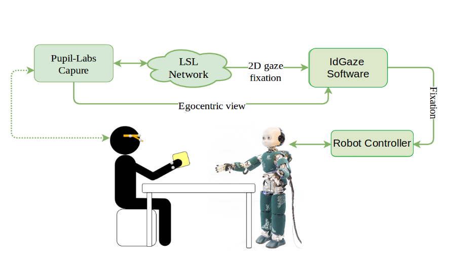

# Identifying from Gaze Fixations the Desired Objects and Faces


### Current version of main.py uses tensorflow object detection network trained on icub faces
So you need to get the [icub-face-detection](https://github.com/NunoDuarte/icub-face-detection) repo to make it work 

# Table of Contents

- [Setup](#setup)
- [Instructions](#instructions)
- [Installation](doc/install.md)
- [Dependencies](#dependencies)
- [Possible Issues](#issues)

## Setup
### Running in [Online](doc/online.md) mode
The software processes works in real-time by processing the information of the PupilLabs head-mpinted eye-tracker online and writting to a YARP port for communication with a humanoid robot (iCub). The whole process is interconnected by a LSL network. 

<figure>

  
<figcaption align = "center"><b>Fig.1 - Diagram illustrating the connections between the different modules that make up the communication of the human eye gaze to the robot fixations. The first module is related to the software that acquires the data from the eye tracker - Capture by Pupil Labs. From this module we collect the 2D fixation point of the subject's gaze projected onto the world view camera on the eye tracker. The stream of the world view camera, together with 2D gaze fixations through LSL network, is sent to idGaze software module to track the relevant fixations.</b></figcaption>
</figure>

### Running in [Offline](doc/offline.md) mode
The software processes recorded data exported from the PupilLabs head-mounted eye-tracker. 

<figure>

  
<figcaption align = "center"><b>Fig.2 - Diagram illustrating the conversion from raw Pupil Labs data to labelled gaze fixations</b></figcaption>
</figure>

## Instructions
- There are two conda virtual environments which were tested and was running (**pupilos** and **pupilos-10**). Pupilos was working for tensorflow 1.9 and CUDA-8.0 and pupilos-10 was working for tensorflow 2.7 and CUDA-11.2
1. add anaconda
```
source activate pupilos***
```
2. install tensorflow models - object detection
3. add package utils (follow [dependencies](#dependencies))

## Dependencies
You need to use the following packages from utils:
```
from utils import label_map_util
from utils import visualization_utils as vis_util
```
to import **utils** you need to install tensorflow with gpu then get the models of tensorflow for object recognition to recognize the import 
you need the following (after you have followed the instructions on how to install tensorflow models)
``` 
cd software/tensorflow/models/research
export PYTHONPATH=$PYTHONPATH:$(pwd)/slim
echo $PYTHONPATH 
export PYTHONPATH=$PYTHONPATH:$(pwd):$(pwd)/object_detection 
```

## Issues
If you find this problem when using codeblocks:
```
pthread_create@2.25 
```
The solution is to add the thread library to both the compiler and linker. You can find an example in this [link](https://askubuntu.com/questions/568068/multithreading-in-codeblocks).

If you find that it does not recognize libYARP_init.so.3 even though it recognizes libYARP_init.so. A good quick workaround is to add the path to the yarp libs to the Search directories. You can find an example in this [link](http://forums.codeblocks.org/index.php?topic=18661.0). You have to go to project->Build options...->Search directories->Linker and add the directory there "../../../../middleware/yarp/build/lib"

If you cannot find shared library (e.g. liblsl64.so.1.2.0) it works if you right click project->Build options...->Search directories->Linker and add the directory there. The directory where liblsl64.so.1.2.0 is for example
